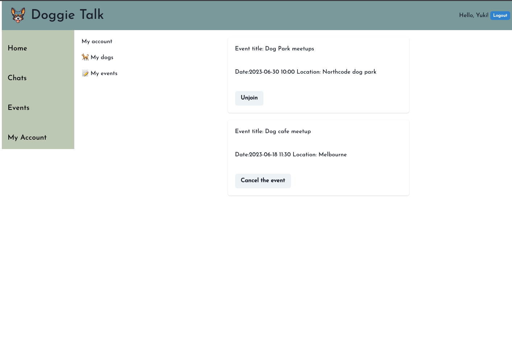
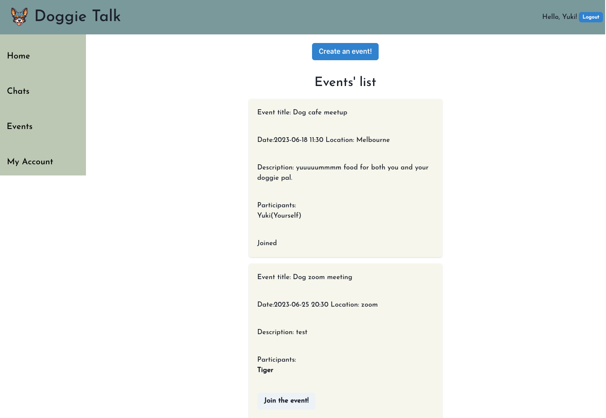
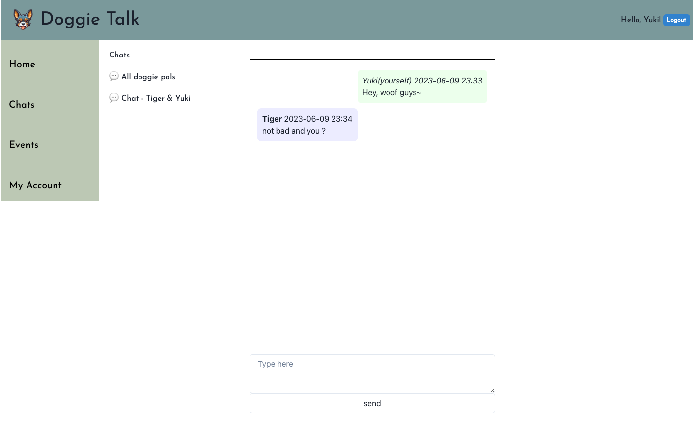

# Doggie Talk(Real time chat app for dog lovers/owners)

### **App features**

---

Users will join in the big group chat by default;
After logging in, random dog fact and image will be rendered;
Allow users to have a real time communication with other valid users;
Allow users to create a PM chat with the menbers in the main group chat;
Allow users to post/join/unjoin/cancel in other type of events;
Allow users to add/delete their dogs.

### **App screenshot**

---





### **Technologies used**

---

- Node Express framework
- React vite framework
- Back End: Typescript , PostgreSQL , Prisma(ORM) and socket.io
- Front End: HTML, CSS, Chakra and Typescript and socket.io

### **General Approach**

---

- Choosing the Tech Stack : After deciding the theme of the app, based on the requirements and desired functionality, made the desictions regarding the programming language, frameworks, libraries, and databases.

- Designing the Database Schema: : Determined the structure of the database that would store the data correctly. Tables includes users, chat groups, chat, events and dogs. Using Prisma to simplify the database interactions by providing an ORM layer.

- Setting up the Backend: Built the server-side logic using Node.js and Express and used Typescript adds static typing and enhances code quality and maintainability.

- Develpoing the Frontend: Utilized React and Vite to create an interative user interface for the chat app.

- Implementing Real-Time communication: Incorporated socket.io to enable real-time communication between the server and clients.

- Testing and Debugging: Identify and fix any bugs or issue that arise during the testing phase.

### **set up instructions**

---

- Express

```
cd server
npm i
npm run dev

```

- PostgreSQL and prisma

```createdb doggie_talk
   npx prisma generate
   npx prisma migrate dev --name "init"
```

- .env

```
PORT=3000

DB_NAME="doggie_talk"

DATABASE_URL="postgresql://{database_username}:{systerm password}@localhost:{client-side port}/doggie_talk"

SECRET_KEY="secret"

```

- Vite + React

```
cd client
npm i
npm run dev
```

- Prisma Studio

```
cd server
npx prisma studio
```

### **upcoming features**

---

- friends requests
- personal avator
- emoji involved in chat
- allow users to upload dog's pic when add dogs
- new msg notification
